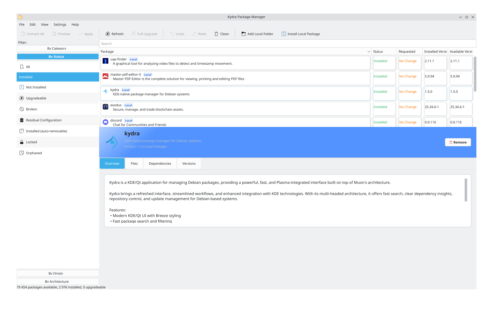

# Kydra

A powerful, KDE-native package manager forked from Muon.



Kydra brings a modern, Plasma-integrated interface to Debian package management. Designed around clarity and speed, it gives users full control of repositories, updates, packages, and system components through a clean, multi-view UI.

## ✨ Features

*   **⚡ Fast & Responsive**: Multi-threaded architecture ensures the UI never freezes during package operations.
*   **🔍 Powerful Search**: Filter by status (installed, upgradeable), category, or technical details with instant results.
*   **📦 Complete Package Management**: Install, remove, purge, and upgrade packages with ease.
*   **🕸️ Dependency Visualization**: View and understand package dependencies before making changes.
*   **🔧 Repository Control**: Manage your sources, PPAs, and updates directly from the settings.
*   **📂 Local Package Support**: Seamlessly install downloaded `.deb` files, and open them straight from your file manager.
*   **🗄️ Local Repository**: Turn a folder of your own `.deb` builds into an apt source, so updates pick up every new version you drop into it.
*   **🎨 Plasma Integration**: Built with Qt and KDE Frameworks to look and feel at home on your desktop.

## 🚀 Quick Start

### Launching Kydra
You can find Kydra in your application menu under **System > Package Manager**, or run it from the terminal:

```bash
kydra
```

### Common Tasks

*   **Find a Package**: Use the search bar at the top. You can filter results using the sidebar categories.
*   **Install/Remove**: Click the checkbox next to a package name to mark it for Installation or Removal.
*   **Apply Changes**: Click the **Apply Changes** button in the toolbar to execute your queued actions.
*   **Update System**: Click **Refresh** to refresh package lists (and the local repository, if one is set up), then **Full Upgrade** to mark all upgrades.
*   **Open a .deb File**: Right-click it in your file manager and choose **Open With > Kydra**. If Kydra is already running, the package opens in that window.

## 🗄️ Local Repository

If you build your own packages, Kydra can keep them up to date like any others.

1.  **Settings > Set Up Local Repository...** asks for the folder that holds the `.deb` files. Kydra indexes it, adds it to apt's sources (this asks for your password), and checks for updates.
2.  After putting a new build in the folder, click **Refresh** (or choose **Settings > Update Local Repository**): Kydra indexes the folder, then checks for updates. The new version then shows up as an ordinary upgrade, in Kydra and in `apt upgrade`. If the folder is on a share that is not mounted, Refresh still checks every other source.

The folder can hold the packages directly, or one subfolder per architecture (`arm64/`, `amd64/`, ...), in which case each subfolder is indexed and apt on each machine reads its own. Every version in the folder is listed, and apt upgrades to the newest.

The index can also be updated without Kydra, for instance at the end of a build script:

```bash
/usr/lib/$(dpkg-architecture -qDEB_HOST_MULTIARCH)/libexec/kydra/kydra-repo-index ~/Packages
```

⚠️ The index is not signed, so apt trusts whatever is in the folder: anyone who can write to it can have software installed as root. Keep it somewhere only you can write to. apt reads the folder as its own user, so it also has to be readable by others - Kydra checks this and says which folder is in the way.

## 📥 Download Kydra

You can download the latest **.deb package** here:

➡️ **[Latest Kydra Release](https://github.com/CygX1-lab/kydra/releases/)**

Once downloaded:

```bash
sudo dpkg -i kydra*.deb
sudo apt --fix-broken install
```

## 🏗️ Building from Source

For detailed instructions on building Kydra from source, including all dependencies and compilation steps, please refer to [INSTALL.md](INSTALL.md).

## 📞 Getting Help

If you encounter any issues or have questions, please contact:

*   **Email**: `cygnx1@gmail.com`

## 💖 Support Development

This project is free and open-source software released under the GNU GPLv3. If you find it useful, consider supporting development:

*   **Bitcoin (BTC)**: `bc1q4z3d06unklcp868wgy6uy8t6y424r8hvy32uvw`
*   **Ethereum (ETH)**: `0xcAFdd35c1e00e6cc142F3df0c5DA4B0D428e6bf9`
*   **Solana (SOL)**: `89xBb3fXYm68WHJsi7hpNBv4hVcaN3GJVXsLNiuYVqv1`
